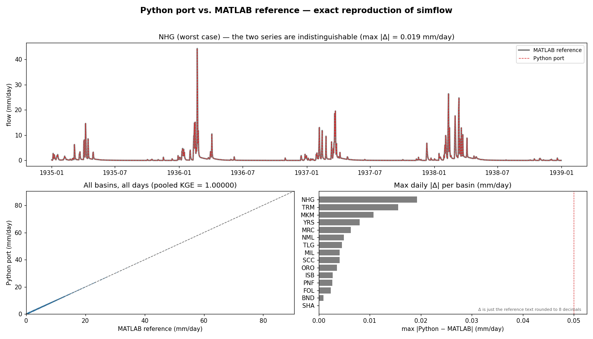
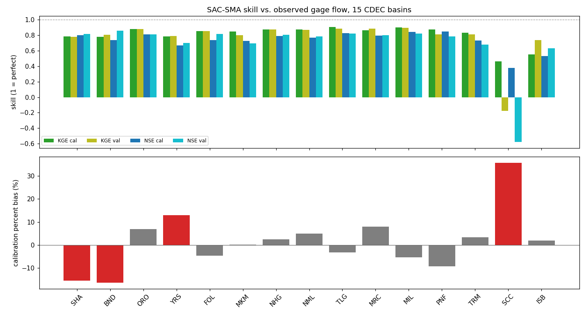

# SAC-SMA (Python)

A faithful **NumPy/Numba port** of the Sacramento Soil Moisture Accounting
(SAC-SMA) hydrologic model and its coupled modules — Hamon PET, Snow-17, and
Lohmann routing — for daily streamflow over California watersheds.

## Origin

The model was developed by **Sungwook Wi & Scott Steinschneider** (Cornell /
UMass Amherst) for the **CA DWR San Joaquin Watershed Studies**, as a spatially
distributed SAC-SMA built from ~6,000 hydrologic response units (HRUs) across 15
CDEC reservoir watersheds, calibrated with a pooled-KGE genetic algorithm.

The original implementation is **MATLAB** (the per-unit physics functions plus a
driver that loops over HRUs and area-sums routed flow to each gauge). This repo
**ports that MATLAB to Python** — matching the numerics so the Python forward run
reproduces the MATLAB output to floating-point tolerance — while reading clean,
Python-native data artifacts instead of the loose `.txt` reference files.

The MATLAB source and raw reference inputs were converted once by `sacsma/dataprep.py` 
into the organized `data/` store the model actually runs on.

## Install

```bash
mamba env create -f environment.yml   # or: conda env create -f environment.yml
mamba activate sacsma
pip install -e .
```

## Run

Forward-simulate a CDEC basin (or all 15) from the archived GA optimum:

```bash
sacsma run BND                        # one basin -> mean daily flow
sacsma run ALL --out flow.csv         # all 15 basins -> CSV per basin
```

```python
from sacsma.model import run_basin
df = run_basin("BND", data_dir="data")   # DataFrame[date, flow] in mm/day
```

Regenerate the calibration/validation diagnostic figures:

```bash
python -m sacsma.plots                # -> artifacts/15cdec/
```

See [`data/README.md`](data/README.md) for the data store and the `dataprep`
ingest commands (forcing, GIS, reference, gage).

## Results — 15 CDEC basins

The Python port reproduces the MATLAB simulated flow **exactly** across all 15
basins over 1915–2018 (pooled KGE ≈ 1.0, max daily difference < 0.02 mm/day):



Against the **observed** gage full-natural-flow, calibration skill matches the
published study (mean KGE ≈ 0.83), with separate calibration/validation
statistics per basin:



Per-basin diagnostics, the skill summary, the parity figure, and
`metrics_15cdec.csv` live in [`artifacts/15cdec/`](artifacts/15cdec/).

## License

MIT (see [`LICENSE`](LICENSE)). Port of the Wi & Steinschneider SAC-SMA model
for CA DWR.
