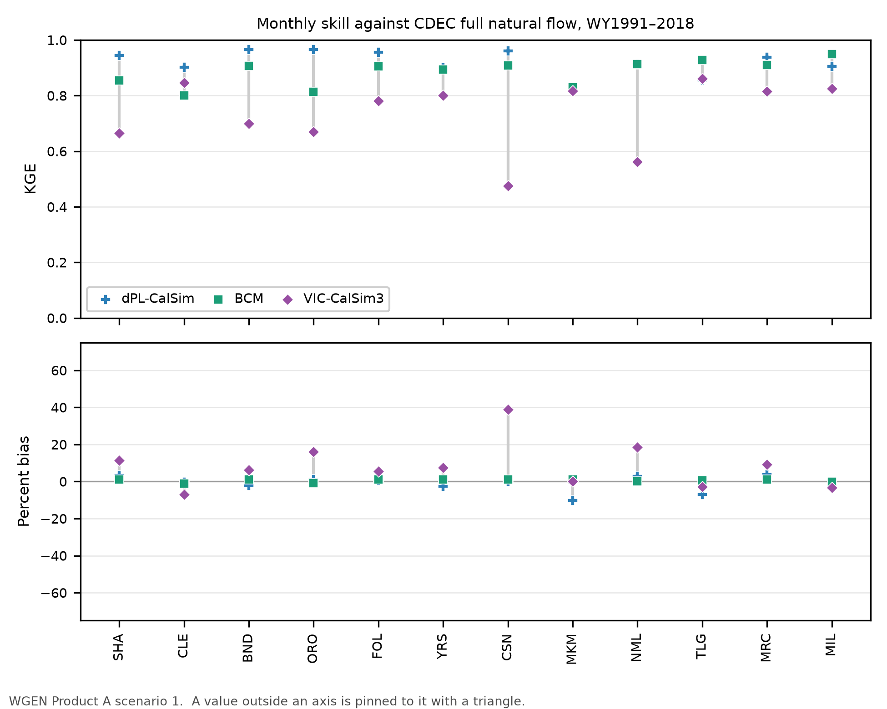

# Benchmark

Three models of the same California watersheds, side by side against the observed record: the
learned-parameter dPL-CalSim (`7_calsim`), the USGS Basin Characterization Model (BCM) with its
monthly routing, and the VIC of the CalSim3 pipeline. The watersheds are 12 CDEC
full-natural-flow (FNF) sites of the learned-parameter registry: the CDEC watersheds of the
original study outside the Tulare basin less New Hogan (NHG), whose observed record in the
window is 95 months, and the Trinity (CLE) and the Cosumnes (CSN). All three run on the same
climate, WGEN Product A scenario 1. The score is monthly, WY1991–2018, against observed CDEC
FNF.

All files, the per-site table and the figures:
[`artifacts/results/benchmark/`](../artifacts/results/benchmark/README.md).

## The models

| Model | How it makes flow at the site | Forcing | Sites | Fitted to these records |
|---|---|---|---|---|
| dPL-CalSim | Its trained parameter field on the CPU engine ([CalSim3 rim inflows](calsim3_rim_inflows.md)) | WGEN Product A scenario 1 | 12 | yes, trained on them |
| BCM | BCM v8 `run` and `rch` routed by the USGS monthly routing equations, with parameters fitted here on WY1991–2018 | BCM Scenario 1, the same sequence | 12 | the routing only, WY1991–2018 |
| VIC-CalSim3 | Routed VIC at the site's CalSim3 node | WGEN Product A scenario 1 | 12 | not documented |

WY1991–2018 is the window where the WGEN temperature detrending is small. BCM is averaged over
each site's cells in the learned-parameter registry.

## How it is scored

- The observation is CDEC's monthly full natural flow at the site's station. CLE has none and
  is scored on the series of Trinity River at Lewiston just below it, scaled to CLE's volume
  (−1.4 %). NML has none either and is scored on complete months of its daily record.
- At each site, every model present is scored on the same months.
- KGE, NSE, percent bias, r, and the seasonal mismatch (the fraction of the annual flow in the
  wrong month).

## Result

Over the 12 sites (`summary.csv`):

| Model | Median KGE | Median NSE | Median bias | Mean \|bias\| | Median seasonal mismatch | Highest KGE at |
|---|---|---|---|---|---|---|
| dPL-CalSim | 0.93 | 0.93 | 0 % | 3 % | 0.06 | 8 sites |
| BCM | 0.91 | 0.82 | +1 % | 1 % | 0.08 | 4 sites (MKM, NML, TLG, MIL) |
| VIC-CalSim3 | 0.79 | 0.79 | +7 % | 11 % | 0.11 | 0 |

- dPL-CalSim has the highest KGE at 8 of the 12 sites, BCM at TLG, MIL, MKM and NML (the last
  two by less than 0.005). Both were fitted to these records over this window, so this is
  in-sample skill. dPL-CalSim is lowest at MKM (0.83, −10 % in volume) and TLG (0.86, −7 %).
- BCM, with its routing fitted here, is second on median KGE and within about 1 % in volume at
  every site, which the fit holds it to.
- VIC-CalSim3 has the lowest median KGE and runs high at most sites, most at CSN (+39 %), NML
  (+19 %) and ORO (+16 %).



## BCM's monthly routing

BCM has no channel routing: its `run` and `rch` are water generated in a month. The USGS routes
them through three reservoirs (surface, shallow, deep) fitted per basin, in a workbook delivered
with the BCM release ([BCM README](../data/reference/bcm/README.md#monthly-routing); the
repository ports its formulas exactly, and `sacsma verify bcm` checks the port against the
workbook's own numbers). Those parameters were fitted on PRISM-forced BCM, and on the WGEN-forced
run they carry a volume error of up to +15 %. The benchmark fits the same equations itself, per
site, on the WGEN-forced run against the observed flow of the whole scoring window,
WY1991–2018, the years dPL-CalSim was trained on, with KGE as the objective and the volume held
within 1 %. That covers all 12 sites instead of the workbook's 10, scores above the workbook at
9 of its 10 (median KGE 0.91 against 0.84) and cuts the median volume bias from +9 % to +1 %.
Fitted on either half of the window and scored on the other, the same routing keeps a median
KGE of 0.90. The workbook routing is kept beside it for comparison.

## What to keep in mind

- dPL-CalSim and the BCM routing were both fitted to these records over this window: the
  benchmark ranks how well each model reproduces the record, not how well it predicts
  elsewhere.
- BCM's yield against the observations shifts from decade to decade. The fit holds the volume
  of the whole window, but a single decade can be off by up to 12 % (MKM, WY2001–2010).
- dPL-CalSim was trained on the daily records, which run 3 to 6 % below the monthly series at
  YRS, CSN, MRC and MKM.

## Command

```bash
sacsma benchmark      # -> artifacts/results/benchmark/; about 2 min on CPU, 10 s once cached
```
