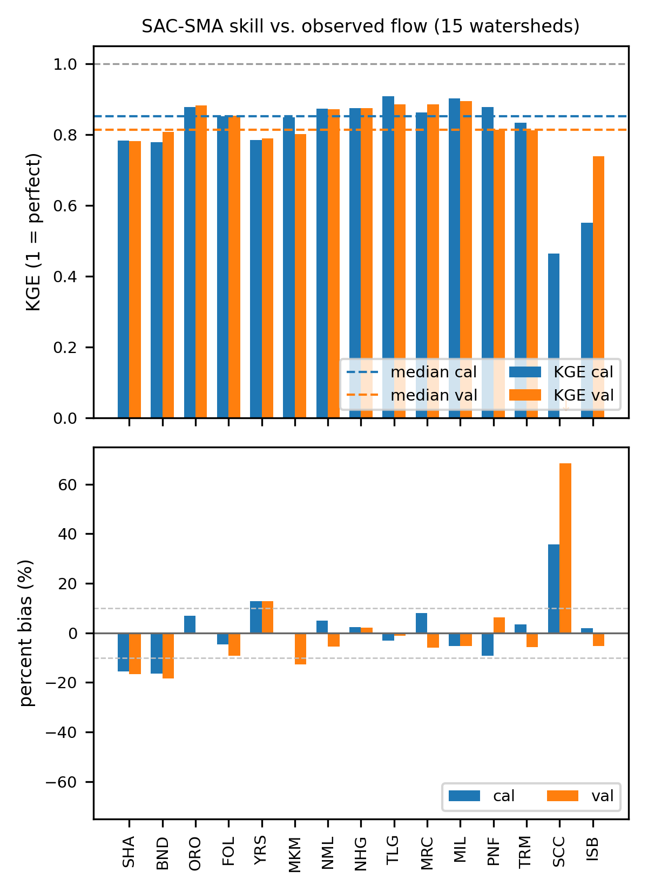
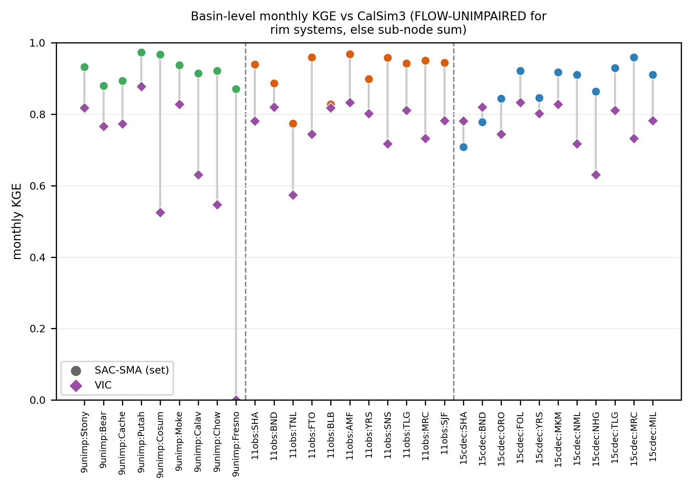

# Calibrated SAC-SMA

The reference model run with the archived genetic-algorithm (GA) calibrations of Wi and
Steinschneider ([2023](references.md#wimemo)). This is the original line of work in the
repository: four calibration sets, their skill against their own targets, and their skill
against CalSim3's historical inflows. The model itself is described in [The model](model.md).

## The four calibration sets

| Set (`--domain`) | Watersheds | Target | Calibration | Role |
|---|---|---|---|---|
| CDEC15 (`15cdec`) | 15 | CDEC daily full natural flow | one pooled GA, WY1989–2003 | daily model of the major Sierra and Cascade reservoir watersheds |
| Rim12 (`12rim`) | 12 | monthly reservoir inflow (impaired) | one GA per watershed, WY1952–2003 | the CalLite main inflows |
| Observed11 (`11obs`) | 11 | monthly unimpaired flow at gauges | one GA per watershed, WY1952–2013 (SHA from 1987, BLB from 1995) | water-year-type gauges |
| Unimpaired9 (`9unimp`) | 9 | monthly unimpaired creek flow | one GA per watershed, WY1952–2010 | rain-fed valley creeks |

Code: `sacsma.cdec15` holds the 15-CDEC application, `sacsma.calsim` the three CalLite sets and
the comparison with CalSim3. `calsim` may import `cdec15`, never the reverse.

**How the parameters are tied to the landscape.** Parameters are not calibrated per HRU. They
take one value per landscape class, and one set of snow and routing parameters is shared
across a calibration. In the archived 15-watershed table the 15 soil-moisture parameters are
constant within each class of the `veg_class` column (12 classes) and `Kpet` within each class
of `soil_class` (11 classes), which leaves about 200 free parameters for the whole domain.
HRUs of the same class share parameters wherever they are, which is what lets the calibration
transfer to ungauged places. The study's description ties the soil-moisture parameters to the
STATSGO soil class; the class codes in the delivered tables carry no legend, so the column
names here are those of the files.

**The two designs.** CDEC15 is a single GA run ([Wang, 1991](references.md#wang1991)) that
maximizes the mean KGE ([Gupta et al., 2009](references.md#gupta2009)) over all 15 daily
records at once ([Wi et al., 2015](references.md#wi2015)), validated on WY2004–2018. Each
CalLite watershed has its own GA against its monthly target, validated on the earlier record,
about WY1922–1951.

## Skill against each set's own target

Means of the per-watershed scores (`artifacts/results/calibrated/<set>/metrics.csv`). CDEC15 is scored on daily
flow, the others on
monthly flow. The CDEC15 calibration score covers each gauge's record up to September 2003,
which starts before WY1989 at eight gauges and in October 1999 at BND.

| Set | Calibration KGE | Validation KGE | Calibration \|bias\| | Validation \|bias\| |
|---|---|---|---|---|
| CDEC15 | 0.80 | 0.77 | 8.7 % | 11.7 % |
| Unimpaired9 | 0.96 | 0.84 | 0.6 % | 10.4 % |
| Observed11 | 0.96 | 0.82 | 0.8 % | 13.1 % |
| Rim12 | 0.91 | 0.79 | 3.3 % | 12.8 % |

The per-watershed calibrations fit closely in their own period. The pooled CDEC15 calibration
fits less closely and loses little out of sample. Weak cases: SCC (Tule River; validation KGE
−0.18, +69 % volume), SHA and BND in the pooled set (−15 to −18 % volume), Trinity (TNL
validation KGE 0.42, +35 %; TRINI 0.50, +31 %), Stony Creek (0.62, +28 %) and Fresno River
(0.66, +16 %). BLB has no validation years.



## Skill against CalSim3

`sacsma calsim` scores each set against CalSim3's own historical inflows, monthly, in
TAF. Rim12 is not part of it. The comparison is at the level of a whole watershed (the
"anchor" score): the watershed's simulated depth on the CalSim3 catchment area, against the
CalSim3 FLOW-UNIMPAIRED series where the watershed is a rim system and against the sum of its
INFLOW arcs elsewhere. The rules behind it are in [Conventions](conventions.md).

Full record, October 1921 to December 2018 (`artifacts/results/calibrated/calsim3/anchor_metrics.csv`,
`anchor_metrics_15cdec.csv`):

| Set | Watersheds | Mean KGE | Median KGE | Mean \|bias\| | VIC mean KGE |
|---|---|---|---|---|---|
| Observed11 | 11 | 0.91 | 0.94 | 4.2 % | 0.76 |
| Unimpaired9 | 9 | 0.92 | 0.92 | 4.9 % | 0.62 |
| CDEC15 | 11 with a CalSim3 reference | 0.87 | 0.91 | 7.6 % | 0.77 |

VIC is the routed VIC simulation used in CalSim3's development, scored the same way. SAC-SMA
scores higher than VIC at all 20 Observed11 and Unimpaired9 watersheds over the full record.
In 30-year windows since 1922 the median KGE of each set stays between 0.86 and 0.96 and above
VIC's in every window (`rolling_skill_30yr.csv`). Watershed by watershed, VIC is level or ahead
in 8 % of the windows, at BLB, Cache Creek, Stony Creek, Putah Creek and SHA
(`rolling_skill_basin_30yr.csv`).
The pooled CDEC15 set under-runs the two large Sacramento systems against CalSim3, by 24 % at
SHA and 22 % at BND, which is why it is scored beside the two anchor sets and not as one.



**Before and after WY1950** (`anchor_metrics_by_period.csv`). The months before WY1950 lie
outside every set's calibration period, so they are a common out-of-sample test.

| Set | Mean KGE, WY1922–1949 | Mean \|bias\| | Mean KGE, from WY1950 | Mean \|bias\| |
|---|---|---|---|---|
| Observed11 | 0.84 | 10.7 % | 0.92 | 4.0 % |
| Unimpaired9 | 0.83 | 12.6 % | 0.93 | 4.2 % |
| CDEC15 | 0.81 | 12.9 % | 0.88 | 7.0 % |

**Single arcs.** Scored one CalSim3 arc at a time (`calset_metrics.csv`), the median KGE is
0.68 (Observed11), 0.67 (CDEC15) and 0.77 (Unimpaired9); summing to the watershed cancels
most of that error. A quantile-mapping correction per arc, fitted on WY1922–1971 and scored on
WY1972–2018, lifts the median over the scored years from 0.68 to 0.81 (Observed11) and from
0.76 to 0.86 (Unimpaired9) (`subarc_validation_metrics.csv`).

**How close the calibration targets are to CalSim3** (`target_vs_calsim3.csv`). Of the 20
watersheds, the target agrees with CalSim3 at 11, differs as a data product at 6 (Cache Creek
−11 %, Bear River −8 %, Fresno River +7 %, among others), and differs through the drainage area
at 3 (Chowchilla −10 %, SNS −9 %, YRS +8 %). These offsets are the bias a perfect fit to the
target would still show against CalSim3. They are left visible.

Maps and figures show skill at the level of the whole watershed: every catchment polygon
carries its watershed's anchor score, never its own arc score, which stays in the tables. The
footprint screening of SHA, BND, SNS and Chowchilla (only those four watersheds over-reach
their CalSim3 catchment materially) is shown in `artifacts/results/calibrated/footprints/`, with the HRU attribute
maps; both are illustrations of the method and the inputs, not part of the scoring. The
unscreened scores and the difference are in `anchor_metrics_full.csv` and
`anchor_screened_vs_full.csv`.

More figures: [`artifacts/results/calibrated/calsim3/figures/`](../artifacts/results/calibrated/calsim3/figures/); the file tables are in
[`artifacts/results/calibrated/README.md`](../artifacts/results/calibrated/README.md).

## SAC-SMA, VIC and BCM on one climate

`sacsma calsim --sacsma-vic-bcm` puts SAC-SMA, VIC and the USGS Basin Characterization Model
(BCM v8) on the same climate and the same 19 watersheds, WY1989–2018, against the same CalSim3
reference: the CalSim3 Weather Generator's historical-parallel sequence, `wgen_product_a` for
SAC-SMA and VIC and its Scenario 1 for BCM. WY1989–2018 is the most recent 30 water years all
three cover (BCM ends in September 2018). Observed11 and Unimpaired9 are pooled into one set of
19: BLB and Stony Creek are the same watershed on the same three arcs, so the Observed11 copy is
dropped. Median KGE is 0.87, 0.77 and 0.66, and SAC-SMA is highest at all 19. That order is
expected, because only SAC-SMA is calibrated to these watersheds
(`artifacts/results/calibrated/vic_bcm/sacsma_vic_bcm_summary.csv`). The content is in the residuals. All three run high
in volume (+4.8, +8.5 and +4.5 %), so the target is low against every independent model of it.
The uncalibrated models lose on the small foothill creeks (BCM +32 to +71 %, VIC +26 to +90 % on
Cache, Calaveras, Chowchilla, Cosumnes and Fresno). BCM's summer flow collapses toward zero in
the snow watersheds, the signature of a water-balance model without baseflow routing, so its
month-to-month timing is to be read more loosely than that of the two routed models.

**How BCM joins the watersheds.** BCM enters on the CalSim3 catchments themselves (`run + rch`
of `bcm_<scenario>_catchments_monthly.csv`, area-weighted over the catchments each watershed
owns), so all three models sit on the same watershed and area and only the depth is each
model's own. BCM was aggregated to the `CalSim3_And_GooseLake` layer (386 polygons); the
watershed areas use `CalSim3_Merged` (200), its dissolve. The two do not join on `Connect_No`:
the merged layer renames each dissolved catchment for its CalSim INFLOW arc (`MCD021` to
`MCD128` become `MCLRE`, the Tuolumne and Putah pieces take their arc's name, the Bend Bridge
valley polygons become `SRBB_VAL`), and a join on the name silently drops four watersheds. So
each BCM polygon goes to the merged polygon that contains its representative point; the
largest overlap would route through boundary slivers and put the 14,452 mi² Tulare Lake Basin
inside Millerton. The Goose Lake block is its own polygon inside no rim catchment, so it needs
no screening. The areas are checked against the watershed areas, so a GIS or crosswalk change
that broke the correspondence stops the comparison.

## Sensitivity to the forcing

**Temperature detrending.** `wgen_product_a` has the same precipitation and a warmed early
record: over the Observed11 watersheds the daily mean is about 1.3 °C higher in the 1910s
(2.1 °C in the daily minimum, 0.4 °C in the maximum), and the shift tapers to zero by the
2010s. Under it the CalLite watersheds lose 1 to 7 % of their long-term runoff,
about 3 % at the median, because Hamon PET rises with temperature. VIC, an energy-budget model,
loses far less volume and shifts the melt season earlier instead. This is the main limitation
of a temperature-only PET, and the reason the learned-parameter model moves to Priestley–Taylor
PET.

**Split and unsplit precipitation.** Under `historical_lto` the anchor skill over the full
record changes little (median KGE 0.93 for both), but it moves between watersheds before
WY1950: Trinity rises from 0.40 to 0.83 and the Cosumnes falls from 0.96 to 0.81
(`artifacts/results/calibrated/forcing/split_unsplit_anchor_skill.csv`). Some of the disagreement
with CalSim3 before 1950 therefore comes from the precipitation data and not from the model.

Figures for both: [`artifacts/results/calibrated/forcing/figures/`](../artifacts/results/calibrated/forcing/figures/), each product against the
Livneh baseline on both models, split at WY1950. The daily runs of the three CalLite sets under
each product, `<product>/sim_daily_<set>.csv`, are written by the comparison when they are
missing.

## Commands

```bash
sacsma run BND                               # one 15cdec watershed (ALL for every one)
sacsma run CacheCreek --domain 9unimp
sacsma run ALL --domain 11obs --forcing wgen_product_a
sacsma plots --domain 15cdec                 # -> artifacts/results/calibrated/15cdec/
sacsma plots --domain 11obs                  # -> artifacts/results/calibrated/11obs/
sacsma calsim                                # the comparison with CalSim3 -> artifacts/results/calibrated/calsim3/, footprints/
sacsma calsim --sacsma-vic-bcm               # -> artifacts/results/calibrated/vic_bcm/
sacsma calsim --forcing-compare              # -> artifacts/results/calibrated/forcing/
```
