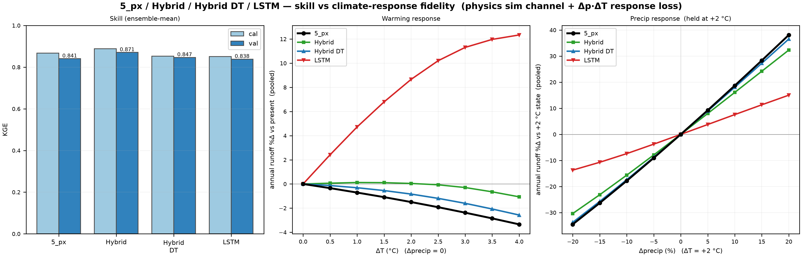

# Learned parameters

Differentiable parameter learning ("dPL", [Tsai et al., 2021](references.md#tsai2021);
[Feng et al., 2022](references.md#feng2022)) replaces the genetic-algorithm search with a small
neural network trained by gradient descent. The network reads the attributes of a modeling unit
and returns its SAC-SMA parameters; the model chain is unchanged. Code: `sacsma.dpl`.

```math
\phi_i = g_\theta(A_i), \qquad \hat{Q} = \mathcal{M}(\phi, F), \qquad
\theta^* = \arg\min_\theta \; \mathcal{L}\big(\hat{Q}, Q^{obs}\big)
```

$A_i$ are the attributes of unit $i$, $\phi_i$ its parameters, $\mathcal{M}$ the model driven
by forcing $F$. No watershed identity enters the network, so one trained network gives
parameters for any place with the same attributes.

## How it is built

**The network.** A per-unit multilayer perceptron (hidden width 64, embedding 32). It emits 28
of the 31 parameters inside the ranges the GA searched ([parameter table](equations.md#6-parameter-table));
two ranges are widened (`rexp` up to 15, `lzsk` down to 0.001). `lzsk`, `lzpk`, `MFMAX` and
`MFMIN` are mapped in log space, so the network can reach the low end of their ranges. With the
learned rain/snow threshold a separate output gives `PXTEMP`. The untrained network returns the
area-weighted median of the `15cdec_grid` GA parameters, so training starts from a plausible field.

**Inputs.** Two sets are in use (`sacsma dpl train <inputs>`):

| Inputs | What the network reads |
|---|---|
| `physical` | elevation, position, flow length, POLARIS soil properties ([Chaney et al., 2019](references.md#chaney2019)), LANDFIRE vegetation, 3DEP terrain, MODIS leaf-area statistics |
| `aef_u` | AlphaEarth satellite embeddings: 16 principal components of the unit embedding direction and its length |

**The physics.** PyTorch, all units in one batch, the reference model's equations
([The model](model.md)) with the percolation sub-steps fixed at ten a day: the reference takes a
number that varies with the state, which cannot be batched. Options on top of the reference
chain:
Priestley–Taylor PET ([Priestley & Taylor, 1972](references.md#priestleytaylor1972)) with
radiation from the daily temperature range
([Bristow & Campbell, 1984](references.md#bristowcampbell1984); [Allen et al., 1998](references.md#allen1998)),
a soil-moisture-limited ET on observed vegetation in the manner of the Noah model
([Ek et al., 2003](references.md#ek2003); [Koren et al., 2010](references.md#koren2010)) with
the SAC-SMA exchange terms kept around it, and a learned rain/snow threshold.

**Training.** One recipe for every run ([the ladder](runs.md#the-ladder)). The loss is a squared
error normalized by each watershed's observed variance, plus a log-flow term and a term that
matches the variance over the record, each chunk weighted by its days. Optimization is AdamW
over water-year chunks, with the model state carried from chunk to chunk and the gradient carried
through two water years: with one, the gradient on the slow lower-zone drainage and on `Kpet` at
Shasta has the wrong sign. The network kept is the one with the best training-period KGE, scored
on the CPU after every epoch.

**Scoring.** A run is scored as it was trained: its field runs on the engine with the numerics
and the basin weights of its training, over the whole record from the cold start
(`sacsma dpl evaluate <checkpoint>`). Test years are never read in training or selection.

## Results on the 15 CDEC watersheds

Each rung of the ladder changes one thing from the one before it: the network in place of the
GA (`1_hru`), grid cells and CalSim3 outlines in place of HRUs (`2_grid`), Priestley–Taylor PET
(`3_pt`), the Noah-type ET (`4_noah`), the learned rain/snow threshold (`5_px`) and AlphaEarth
inputs (`6_aef`). Rungs 1 to 6 train on WY1989–2003. Their mean daily KGE over the 15 watersheds
on WY2004–18 goes 0.768 (GA), 0.838, 0.826, 0.843, 0.844, 0.841, 0.837; the table, with the
held-out decade WY1976–85 and the regional records, is in [Runs](runs.md#the-ladder).

What these runs show:

- **The network generalizes better than the GA with the same physics.** +0.07 on WY2004–18
  and +0.09 on WY1976–85.
- **The grid costs little.** About 0.01 to 0.02 at the outlets, and it is the form that covers
  the CalSim3 catchments.
- **The physics options are even at the 15 outlets.** Priestley–Taylor PET gains about 0.02;
  the Noah-type ET and the learned threshold change the mean by less than 0.01. They are kept
  because PET then responds to radiation, ET to modeled soil moisture, and the snow line to a
  learned threshold.
- **AlphaEarth inputs are even at the outlets and transfer better** to the records the run did
  not train on (+0.18 on the USGS gauges in WY1976–85).
- **An LSTM on the physics adds skill and loses the response to warming** unless it is trained
  to keep it (`hybrid_dt`), which gives most of the skill back. See below.
- **Weaknesses that stayed.** SCC has the lowest WY2004–18 score in every rung (0.45 to 0.62)
  and in `hybrid` and `hybrid_dt`.

## The LSTM hybrids and their response to warming

`hybrid` feeds precipitation, Tmin, Tmax and `5_px`'s simulated flow to an LSTM
([Hochreiter & Schmidhuber, 1997](references.md#hochreiter1997);
[Kratzert et al., 2019](references.md#kratzert2019)), with 27 static attributes of each
watershed (`5_px`'s physical inputs and four climate indices), and scores an ensemble of three
seeds. `hybrid_dt` fine-tunes each `hybrid` seed for 15 epochs with a loss term that pulls the
network's change in flow under 14 combinations of precipitation change (−20 to +20 %) and
warming (0, +2, +4 °C) toward the change `5_px` gives. `lstm` drops the simulated flow from the
inputs.

Change at +3 °C with precipitation unchanged, over the 15 watersheds
(`artifacts/results/dpl/studies/hybrids/hybrids_metrics.csv`):

| | Annual runoff, mean | Same sign as `5_px` | Correlation with `5_px` across watersheds | April–July volume, mean |
|---|---|---|---|---|
| `5_px` | −2.4 % | | | −33 % |
| `hybrid` | −0.3 % | 8 of 15 | −0.12 | −24 % |
| `hybrid_dt` | −1.6 % | 13 of 15 | 0.66 | −31 % |
| `lstm` | +11.3 % | 2 of 15 | −0.40 | −5 % |

`hybrid` keeps most of the physics' shift away from spring, but its change in annual runoff is
unrelated to `5_px`'s and runs from −7.7 % to +10.3 % across watersheds. `hybrid_dt` keeps about
two-thirds of the annual change and nearly all of the spring change, and gives back most of
`hybrid`'s skill (validation KGE 0.847 against 0.871 and 0.841 for `5_px`). `lstm` gains runoff
as it warms. With precipitation changed by ±10 or ±20 % at +2 °C, `hybrid_dt` gives about 93 %
of `5_px`'s change in annual runoff, `hybrid` about 80 % and `lstm` about 40 %.



## From 15 watersheds to the CalSim3 arcs

The rungs above train on 15 daily records. dPL-CalSim (`7_calsim`) trains one network on several
kinds of record at once (daily gauges, monthly unimpaired flows, CalSim3 arc inflows) and its
flow becomes monthly inflows on the CalSim3 rim arcs: [CalSim3 rim inflows](calsim3_rim_inflows.md).

## Where things are

| | |
|---|---|
| Runs | `artifacts/models/dpl/15cdec/<run>/` (checkpoints, parameter tables), `artifacts/results/dpl/15cdec/<run>/` (scores); dPL-CalSim under `multifamily/7_calsim/` |
| Every run's scores, and what was tried and not adopted | [Runs](runs.md) |
| Studies and their figures | [`artifacts/results/dpl/studies/`](../artifacts/results/dpl/studies/), one folder per `sacsma dpl study` |
| The learned numerics against the reference model | [`artifacts/results/dpl/fidelity/`](../artifacts/results/dpl/fidelity/) |

```bash
sacsma dpl fidelity                          # learned numerics against the reference model
sacsma dpl train physical --domain 15cdec --et sac --sac-pet hamon \
    --cpu-select --diagnostics --patience 20 \
    --obs-mask data/targets/cdec/fnf_daily_mask.csv \
    --log-space lzsk,lzpk,MFMAX,MFMIN --param-bounds lzsk=0.001:0.5 --logit-penalty 0.01   # 1_hru
sacsma dpl evaluate <run>/checkpoints/best.pt
sacsma dpl hybrid --physics 5_px --seed 0    # hybrid; lstm: without --physics
sacsma dpl study climatology                 # and: hybrids, forcing
```

Every rung's command is in [Reproduce](reproduce.md).
