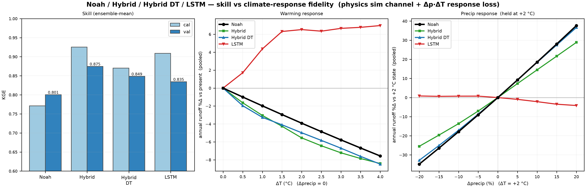

# Learned parameters

Differentiable parameter learning ("dPL", [Tsai et al., 2021](references.md#tsai2021);
[Feng et al., 2022](references.md#feng2022)) replaces the genetic-algorithm search with a small
neural network trained by gradient descent. The network reads the attributes of a modeling unit
and returns its SAC-SMA parameters; the model chain is unchanged. Code: `sacsma.dpl`.

```math
\phi_i = g_\theta(A_i), \qquad \hat{Q} = \mathcal{M}(\phi, F), \qquad
\theta^* = \arg\min_\theta \; \mathcal{L}\big(\hat{Q}, Q^{obs}\big)
```

$A_i$ are the attributes of unit $i$, $\phi_i$ its parameters, $\mathcal{M}$ the model driven
by forcing $F$. No watershed identity enters the network, so one trained network gives
parameters for any place with the same attributes.

## How it is built

**The network.** A per-unit multilayer perceptron (hidden width 64, embedding 32). It emits 28
of the 31 parameters inside the ranges the GA searched ([parameter table](equations.md#6-parameter-table));
two ranges were widened (`rexp` up to 15, `lzsk` down to 0.003). The untrained network returns
the area-weighted median of the archived GA parameters, so training starts from a plausible
field.

**Inputs.** Three sets are in use (`sacsma dpl train <inputs>`):

| Inputs | What the network reads |
|---|---|
| `physical` | elevation, position, POLARIS soil properties ([Chaney et al., 2019](references.md#chaney2019)), LANDFIRE vegetation, 3DEP terrain, MODIS leaf-area statistics |
| `physical_climate` | the same plus four climate indices computed from the forcing, so the parameters change when the climate is perturbed |
| `aef` | AlphaEarth satellite embeddings alone: 16 principal components and the vector length |

**The physics.** PyTorch, all units in one batch, the reference model's equations
([The model](model.md)) with the percolation sub-steps fixed at ten a day: the reference takes a
number that varies with the state, which cannot be batched. Options on top of the reference
chain:
Priestley–Taylor PET ([Priestley & Taylor, 1972](references.md#priestleytaylor1972)) with
radiation from the daily temperature range
([Bristow & Campbell, 1984](references.md#bristowcampbell1984); [Allen et al., 1998](references.md#allen1998)),
a soil-moisture-limited ET on observed vegetation in the manner of the Noah model
([Ek et al., 2003](references.md#ek2003); [Koren et al., 2010](references.md#koren2010)), and a
learned rain/snow threshold.

**Training.** The loss is a squared error normalized by each watershed's observed variance,
plus a log-flow term and a variance-matching term. Optimization is AdamW over year-long
chunks, with the model state carried from chunk to chunk. The network kept is the one with the
best calibration-period KGE.

**Scoring.** A run is scored as it was trained: its field runs on the engine with the numerics
and the basin weights of its training, over the whole record from the cold start
(`sacsma dpl evaluate <checkpoint>`). Validation years are never read in training or selection.

## Results on the 15 CDEC watersheds

Each run changes one thing from the one before it, in this order: the network in place of
the GA (`hamon_dense`), grid cells in place of HRUs (`hamon`), Priestley–Taylor PET (`pt`), the
Noah-type ET (`noah`), an LSTM on top (`hybrid`, `hybrid_dt`) and the LSTM alone (`lstm`).
Their mean daily KGE over the 15 watersheds, calibration WY1989–2003 and validation
WY2004–2018, is in the table of [Runs](runs.md#runs-on-the-15-cdec-watersheds); validation goes
0.768 (GA), 0.838, 0.829, 0.823, 0.801, 0.875 (`hybrid`).

What these runs showed:

- **The network generalizes better than the GA with the same physics.** Validation KGE rises
  from 0.77 to 0.84 with the calibration score unchanged.
- **The grid costs little.** One parameter set per grid cell scores 0.829 in validation
  against 0.838, and it is the form that covers the CalSim3 catchments.
- **Better physics costs a little skill here.** Priestley–Taylor PET and the Noah-type ET
  lower the 15-watershed score slightly. They are kept because PET then responds to radiation
  (and to snow cover in `pt`), and ET to modeled soil moisture.
- **An LSTM adds skill but not a trustworthy response to climate.** See below.
- **Weaknesses that stayed.** FOL's variability is damped in every run. SCC has the lowest
  validation score from `noah` on (0.63, in the hybrids too). NHG's validation volume bias fell
  from +18 % to +1 % along the physics runs and turned negative in the LSTM runs.

## The LSTM hybrids and their response to warming

`hybrid` feeds the forcing and `noah`'s simulated flow to an LSTM
([Hochreiter & Schmidhuber, 1997](references.md#hochreiter1997);
[Kratzert et al., 2019](references.md#kratzert2019)) and scores an ensemble of three seeds.
`hybrid_dt` adds a loss term that pulls the network's change in flow under 14 combinations of
precipitation change (−20 to +20 %) and warming (0, +2, +4 °C) toward the change the `noah`
physics gives. `lstm` drops the simulated flow from the inputs.

Change in annual runoff at +3 °C with precipitation unchanged, mean over the 15 watersheds
(`artifacts/results/dpl/15cdec/studies/hybrids/hybrids_metrics.csv`):

| Model | Change | Same sign as `noah` |
|---|---|---|
| `noah` | −5.8 % | – |
| `hybrid` | −7.2 % | 13 of 15 |
| `hybrid_dt` | −6.7 % | 15 of 15 |
| `lstm` | +6.7 % | 5 of 15 |

The LSTM without physics gains runoff under warming, which is wrong. `hybrid` responds too
strongly and strays from the physics by 5.6 points per watershed on average. `hybrid_dt`
follows the physics (1.6 points), at a cost of about 0.03 validation KGE.



## From 15 watersheds to the CalSim3 arcs

The runs above train on 15 daily records. The current work trains one network on several kinds
of record at once (daily gauges, monthly unimpaired flows, CalSim3 arc inflows) and turns its
flow into monthly inflows on the CalSim3 rim arcs: [CalSim3 rim inflows](calsim3_rim_inflows.md).

## Where things are

| | |
|---|---|
| Runs | `artifacts/models/dpl/15cdec/<run>/` (checkpoints, parameter tables), `artifacts/results/dpl/15cdec/<run>/` (scores) |
| Every run's scores, and what was tried and not adopted | [Runs](runs.md) |
| Studies and their figures | [`artifacts/results/dpl/15cdec/studies/`](../artifacts/results/dpl/15cdec/studies/), one folder per `sacsma dpl study` |

```bash
sacsma dpl benchmark                         # learned numerics against the reference model
sacsma dpl train physical_climate --domain 15cdec_grid --et noah \
    --noah-pet priestley_taylor --calsim-footprint
sacsma dpl evaluate <run>/checkpoints/best.pt
sacsma dpl hybrid --physics noah --statics --no-doy --pet-input --hidden 64 --dropout 0.35 --input-noise 0.2 --seed 0 [--response-lambda 0.18]   # hybrid [hybrid_dt]
sacsma dpl study climatology                 # and: adaptive, hybrids, forcing
```
